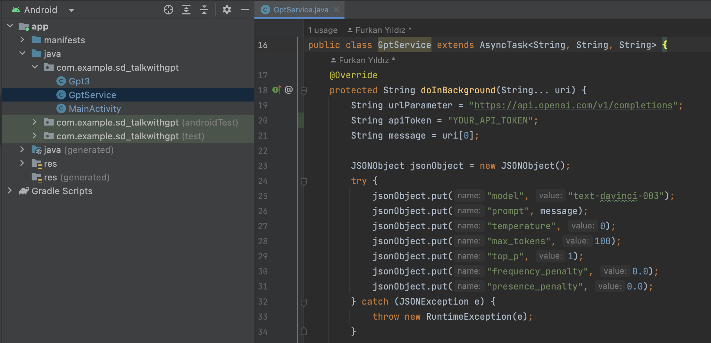
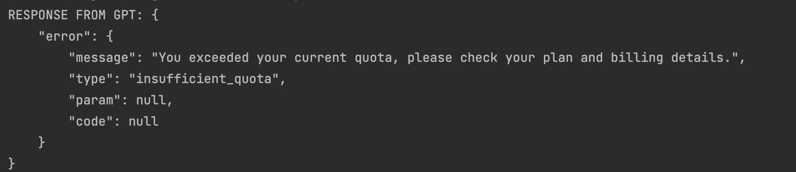
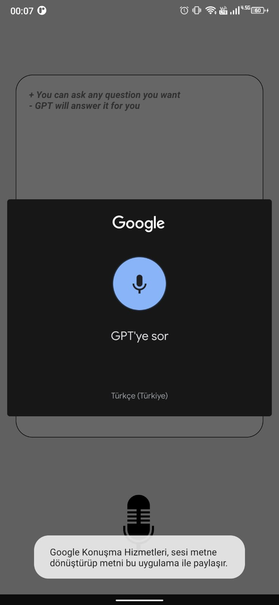
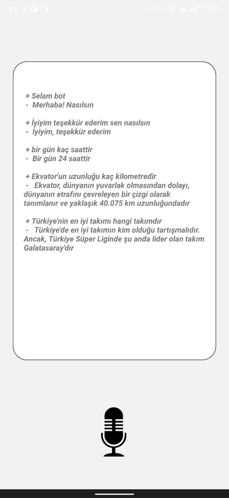

<h1 align="center">ASK2GPT-ANDROID_APP</h1>

Ask2GPT uygulaması üzerinden ses kaydı ile ChatGPT'ye bağlanıp iletişim kurabilirsiniz

<h3><strong>Gerekli Güncellemeler</strong></h3>

Geliştiriciler uygulamayı kullanmadan önce OpenAI web sitesi üzerinden API_TOKEN oluşturup projede gerekli alanı güncellemelidir.
 <a href='https://platform.openai.com/account/api-keys'> OpenAI WebSite - API KEYS </a>

 
 

"apiToken" değişkeni OpenAI üzerinden alınan token ile güncellenmelidir.   Token'ların bir süre sonra yenilenmesi gerektiği ve birçok token kullanıldığında free kullanım için OpenAI üzerinden farklı bir hesap oluşturulması gerekir. Aksi halde dönen response'lar problemi açıklayacaktır.

 
 

<h3><strong>Tanıtım Görüntüleri</strong></h3>

<h3><strong>Notlar</strong></h3>
<i> Minimum SDK Version: 24 </i>
 
<i> Target and Compile SDK Version: 33 </i>